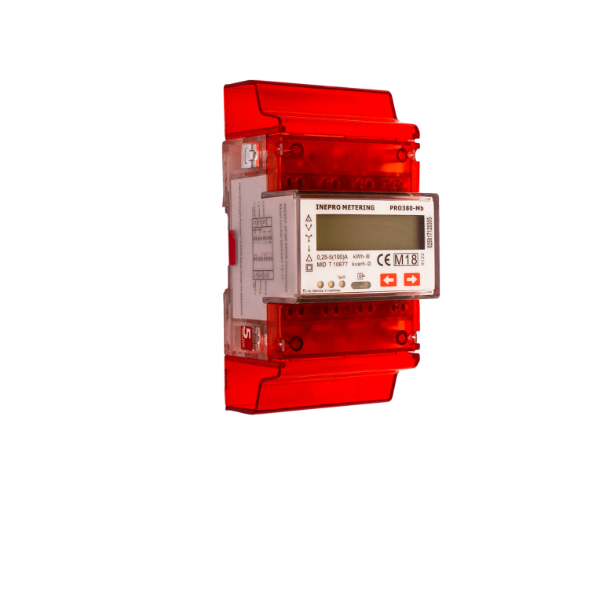
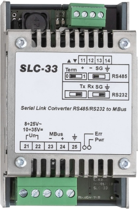
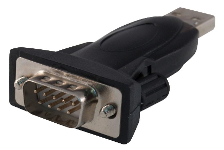
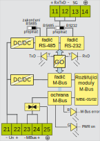

# M-Bus based power meter Python exporter
This repository contains the instructions on how to build the infrastructure to collect data about the usage of electricity and make these data available to [Prometheus](https://prometheus.io/) time series database.

## Hardware installation
This module was developed for and tested with the [inepro PRO380-MB power meter]. This meter device provides a simple [M-Bus](https://en.wikipedia.org/wiki/Meter-Bus) based interface to read the usage data. Writing in the meter registers is not possible.



PRO380-MB is hooked up to an [Elsaco SLC-33 M-Bus to serial] physical interface converter (part number `EI6033.02`).



The SLC-33 requires a serial port with 5V (not TTL 3.3V) levels, therefore the [PremiumCord USB 2.0 -> RS-232] serial port adapter with the FTDI FT232R USB UART chip was used.


You can obviously use any M-Bus-to-serial and serial-to-USB adapter you want, these are just the confirmed working ones.

**Caution: only a certified electrician can hook the PRO380-MB to the power grid. Always request the electrician to do this work for you. Unauthorized working with power grid infrastructure can be live threatening!**

Follow the [PRO380 User Manual] to hook the meter up to the power grid. If your contract supports two tariffs, you can hook up the phase (via a circuit breaker) to tariff clamp 24 and a neutral (switched on by the power grid operator only in case the second tariff is active) to tariff clamp 25.

### PRO380 wiring


### SLC33 block diagram



### M-Bus/serial cross-connection description

* The `PRO380-MB` clips `22` and `23` are connected to the `SLC-33` clips `23` and `24` (M-Bus does not really mind the polarity if only one meter is connected)
* `SLC-33` set-up
  * 12V power source was hooked up to SLC-33 pins 21 and 22 (mind the polarity!)
  * dip switches needed to be moved to the right position (RS-232 mode)
* Serial port connection:
  * serial port pin 2 (RxD) to SLC-33 pin 11 (Tx)
  * serial port pin 3 (TxD) to SLC-33 pin 12 (Rx)
  * serial port pin 5 (GND) to SLC-33 pin 13 (SG)

To ease the serial port connection, I have also bought a cheap serial-to-serial RS232 cable ([ROLINE RS232 Cable, DB9 M-F]), cut the cable, and only used the female connector + cable connected to it.

## Software installation
1. Create `/opt/power_meter` directory and clone this repo to it.
2. Build and install `libmbus` to get the `mbus-serial-request-data` binary.
   1. Install build dependencies (Debian): `apt-get -y install build-essential devscripts`
   2. Clone the `libmbus` repo: `https://github.com/rscada/libmbus`
   3. Build Debian package: `cd libmbus && ./build-deb.sh`
   4. Install the built package (Debian), which is in the directory parent to the one where the package is built, e.g. `dpkg -i ../libmbus1_0.8.0_arm64.deb`
3. Install Python requirements for this tool. Run `pip3 install -m requirements.txt`.
   1. If you are a more advanced Python user, you can of course use a [Python virtual environment](https://packaging.python.org/guides/installing-using-pip-and-virtual-environments/)
4. Create unique and stable symlink to the serial port device.
   1. Edit and deploy `10-usbports.rules` to `/etc/udev/rules.d/` to create the `/dev/ttymeterBus` symlink to the real serial device.
   2. Update your `initramfs`, e.g. by running `update-initramfs -k all -u`.
   3. Reboot for the symlink to get created.
5. Configure the exporter
   1. Copy `prometheus-mbus-exporter.yml.example` to `prometheus-mbus-exporter.yml`
   2. Edit baud rate, meter ID, serial port name, metrics webserver TCP port, and location.
   3. The default baud rate is `2400`, default meter ID is zero (`0`); both can be changed via the meter user interface.
6. Configure `systemd`
   1. Deploy `power_meter_prometheus_exporter.service` to `/etc/systemd/system/`
   2. Run `systemctl daemon-reload && systemctl enable power_meter_prometheus.service && systemctl start power_meter_prometheus.service`
7. Call `curl http://localhost:<port-number>/metrics` and observe the counters
8. Configure your Prometheus instance to collect the data from the exporter endpoint. 

## Live metrics example

```
# HELP power_consumption_total Power consumption
# TYPE power_consumption_total counter
power_consumption_total{location="YourLocation",tariff="1"} 1.78572e+06
power_consumption_total{location="YourLocation",tariff="2"} 1.201213e+07
```

## Copyright and permission notice

Copyright (c) 2019 - 2020, Radek Zajic, radek@zajic.v.pytli.cz.

All rights reserved.

Permission to use, copy, modify, and distribute this software for any purpose with or without fee is hereby granted, provided that the above copyright notice and this permission notice appear in all copies.

THE SOFTWARE IS PROVIDED "AS IS", WITHOUT WARRANTY OF ANY KIND, EXPRESS OR IMPLIED, INCLUDING BUT NOT LIMITED TO THE WARRANTIES OF MERCHANTABILITY, FITNESS FOR A PARTICULAR PURPOSE AND NONINFRINGEMENT OF THIRD PARTY RIGHTS. IN NO EVENT SHALL THE AUTHORS OR COPYRIGHT HOLDERS BE LIABLE FOR ANY CLAIM, DAMAGES OR OTHER LIABILITY, WHETHER IN AN ACTION OF CONTRACT, TORT OR OTHERWISE, ARISING FROM, OUT OF OR IN CONNECTION WITH THE SOFTWARE OR THE USE OR OTHER DEALINGS IN THE SOFTWARE.

Except as contained in this notice, the name of a copyright holder shall not be used in advertising or otherwise to promote the sale, use or other dealings in this Software without prior written authorization of the copyright holder.

[inepro PRO380-MB power meter]: https://ineprometering.com/pro380/
[Elsaco SLC-33 M-Bus to serial]: http://www.elsaco.cz/index.php?file=./produkty/piggy/628_slc33.php
[PremiumCord USB 2.0 -> RS-232]: https://www.gmelectronic.com/converter-usb2-0-to-serial-port-com-premiumcord-ku2-232a
[ROLINE RS232 Cable, DB9 M-F]: https://www.secomp.co.uk/en_GB/roline-rs232-cable-db9-m-f-1-8-m/i/11016218
[PRO380 User Manual]: https://ineprometering.com/wp-content/uploads/2019/04/PRO380-user-manual-V2.18v6.pdf
